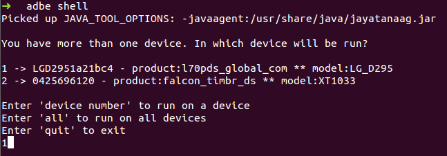

# ADBe

A simple Command-line interface (CLI) that builds upon the existing Android Debug Bridge (ADB) to 
provide better support when dealing with running adb commands on more than one device.

## Motivation

ADB does not support some commands on multiple devices.

If you run a simple command like `adb shell` with multiple connected devices results in an error 
like this:

But now if you run with adbe you will get this:

Giving the option to run this command on individual devices or on all of them.

## Usage

- Download project.
- Move adbe.scala file that is located in src to the folder you want and add to the path.
- Now simply run the command `adbe`.

Note: The **adbe** file that is located in the project root is just a **symbolic link** and 
**don't** duty be used.

## Requirements

- Scala 2.11.5 and adb on PATH.

## More

For more information on installing the scala check out facilities [page](./INSTALLATION.md).

ADBe is a work in progress, feel free to improve it.

## License

ADBe is released under the MIT license. See [LICENSE](./LICENSE) for details.

## Issues

For questions, bug reports, improve documentation, and feature request please
search through existing
[issue](https://github.com/hpedrorodrigues/ADBe/issues) and if you don't
find and answer open a new one [here](https://github.com/hpedrorodrigues/ADBe/issues/new).
If you need support send me an [email](mailto:hs.pedro.rodrigues@gmail.com). You can also
contact [me](https://github.com/hpedrorodrigues) for any non public concerns.

## References

- [Getting started with Scala](http://www.scala-lang.org/documentation/getting-started.html)